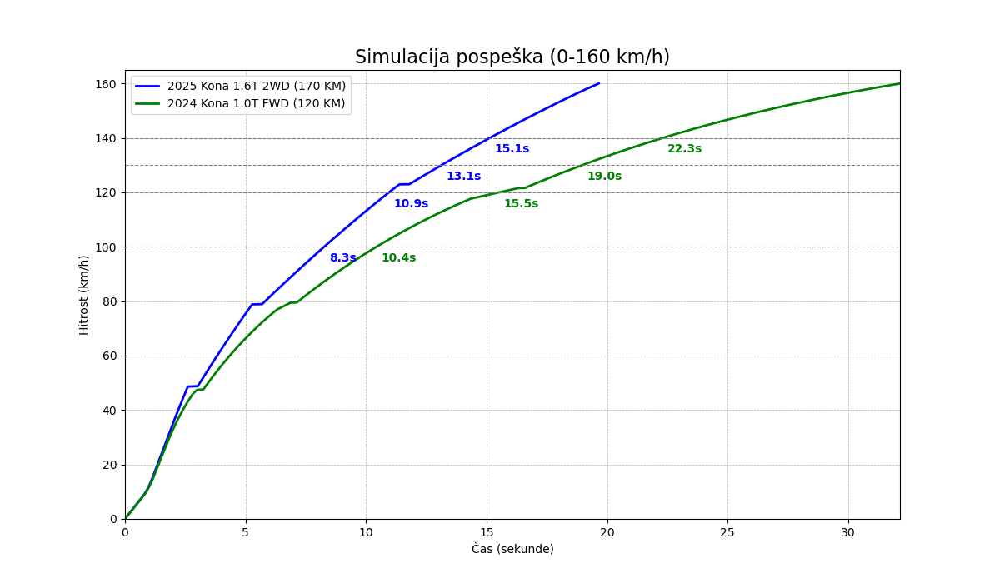

# Hyundai Kona Performance Comparison

A comprehensive vehicle dynamics simulation comparing the performance characteristics of two Hyundai Kona variants:
- **2025 Kona 1.6T 2WD (170 HP)** - Turbocharged 1.6L engine with 2-wheel drive
- **2024 Kona 1.0T FWD (120 HP)** - Turbocharged 1.0L engine with front-wheel drive

## Overview

This project provides detailed performance analysis through vehicle dynamics simulation, including:
- Engine torque and power curves
- Acceleration performance (0-160 km/h)
- Tractive effort analysis
- Cruising RPM characteristics

## Features

### 🚗 Vehicle Parameters
- Accurate mass, aerodynamic coefficients, and drivetrain specifications
- Real gear ratios and final drive configurations
- Calibrated engine torque curves based on manufacturer specifications

### 📊 Performance Analysis
- **Acceleration Simulation**: 0-100, 0-120, 0-130, and 0-140 km/h times
- **Engine Characteristics**: Torque and power curves across RPM range
- **Tractive Force**: Analysis of available pulling force vs. vehicle speed
- **Fuel Efficiency**: RPM analysis at highway cruising speeds

### 🎯 Calibrated Performance Targets
- **1.6T Engine**: Tuned for ~8.5s 0-100 km/h acceleration
- **1.0T Engine**: Tuned for ~10.2s 0-100 km/h acceleration
- Power output: 125.0 kW (170 HP) at 6000 RPM for 1.6T

## Generated Plots

### 1. Engine Performance Curves
Displays torque (Nm) and power (kW) characteristics across the engine RPM range.

### 2. Acceleration Performance

*Comparison of 0-160 km/h acceleration times with milestone markers*

### 3. Tractive Effort Analysis
Shows maximum pulling force available in each gear vs. vehicle speed, compared against resistive forces.

### 4. Highway Cruising RPM
Engine RPM requirements at various highway speeds in top gear.

## Technical Implementation

### Vehicle Dynamics Model

The simulation employs fundamental principles of vehicle dynamics and thermodynamics to model acceleration performance. The core physics are based on Newton's second law applied to vehicular motion.

#### Force Balance Equation

The net force acting on the vehicle during acceleration is:

```
F_net = F_tractive - F_resistance
```

Where:
- **F_tractive**: Tractive force transmitted to the wheels
- **F_resistance**: Total resistive forces (aerodynamic + rolling resistance)

#### Tractive Force Calculation

The tractive force is derived from engine torque through the drivetrain:

```
F_tractive = (T_engine × i_gear × i_final × η_drivetrain) / r_wheel
```

Where:
- **T_engine**: Engine torque at current RPM [Nm]
- **i_gear**: Current gear ratio
- **i_final**: Final drive ratio
- **η_drivetrain**: Drivetrain efficiency
- **r_wheel**: Effective wheel radius [m]

#### Resistance Forces

**Aerodynamic Drag:**
```
F_aero = ½ × ρ × C_d × A × v²
```

**Rolling Resistance:**
```
F_rolling = C_rr × m × g
```

Where:
- **ρ**: Air density (1.225 kg/m³)
- **C_d**: Drag coefficient (0.27)
- **A**: Frontal area [m²]
- **v**: Vehicle velocity [m/s]
- **C_rr**: Rolling resistance coefficient (0.012)
- **m**: Vehicle mass [kg]
- **g**: Gravitational acceleration (9.81 m/s²)

#### Differential Equation of Motion

The fundamental equation governing vehicle acceleration:

```
m × dv/dt = F_tractive - F_aero - F_rolling
```

This is solved numerically using a simple Euler's method with a time step dt of 0.01 seconds:

```
v(t+Δt) = v(t) + (F_net/m) × Δt
```

### Engine Modeling

#### Torque Curve Synthesis

Engine torque characteristics are modeled using piecewise linear interpolation based on manufacturer specifications:

**1.6T Engine Model:**
```
T(RPM) = {
    interp([1000, 1900], [105, 218])     if RPM < 1900
    218                                   if 1900 ≤ RPM ≤ 4000
    interp([4000, 6000, 6500], [218, 199, 168])  if RPM > 4000
}
```

**1.0T Engine Model:**
```
T(RPM) = {
    interp([1000, 2000], [100, 200])     if RPM < 2000
    200                                   if 2000 ≤ RPM ≤ 3500
    interp([3500, 6000], [200, 120])     if RPM > 3500
}
```

#### Power Calculation

Engine power is calculated using the fundamental relationship:

```
P = T × ω = T × (2π × RPM) / 60
```

Where power is in Watts when torque is in Nm and RPM is in revolutions per minute.

### Transmission Modeling

#### Gear Shift Logic

Gear shifts occur when engine RPM reaches the shift threshold (6200 RPM):

```python
if RPM ≥ RPM_shift and current_gear < max_gears:
    t += shift_time
    current_gear += 1
    RPM = (v × 60) / (2π × r_wheel) × i_total_new
```

#### Dual Final Drive System (1.0T)

The 1.0T model incorporates a dual final drive configuration:
- Gears 1, 2, 4, 5: Final drive ratio = 4.643
- Gears 3, 6, 7: Final drive ratio = 3.611

### Simulation Algorithm

The acceleration simulation employs a discrete-time integration approach:

1. **Initialize**: Set initial conditions (v₀ = 0.01 m/s, t₀ = 0, gear = 1)
2. **Calculate RPM**: `RPM = (v × 60) / (2π × r_wheel × i_total)`
3. **Check gear shift**: If RPM ≥ threshold, shift up
4. **Compute forces**: Calculate tractive and resistive forces
5. **Apply Newton's law**: `a = F_net / m`
6. **Update velocity**: `v = v + a × Δt`
7. **Update time**: `t = t + Δt`
8. **Repeat**: Until target velocity is reached

### Calibration and Validation

The engine torque curves are calibrated to match real-world acceleration targets:
- **1.6T**: ~8.5 seconds (0-100 km/h)
- **1.0T**: ~10.2 seconds (0-100 km/h)

This calibration ensures the simulation reflects realistic performance characteristics while maintaining physical accuracy in the underlying mathematical model.

## Technical Specs

### 2025 Kona 1.6T 2WD
- **Mass**: 1450 kg
- **Engine**: 1.6L Turbocharged (170 HP / 125 kW)
- **Drivetrain**: 2WD with 8-speed automatic
- **Peak Torque**: 218 Nm @ 1900-4000 RPM
- **Drivetrain Efficiency**: 92%

### 2024 Kona 1.0T FWD
- **Mass**: 1410 kg
- **Engine**: 1.0L Turbocharged (120 HP / 88 kW)
- **Drivetrain**: FWD with 7-speed DCT
- **Peak Torque**: 200 Nm @ 2000-3500 RPM
- **Drivetrain Efficiency**: 90%

## Results Summary

The simulation demonstrates the performance advantages of the larger 1.6T engine while highlighting the efficiency characteristics of both powertrains across different driving scenarios.

---

*This simulation is based on publicly available manufacturer specifications and engineering estimates for educational and comparison purposes.*
